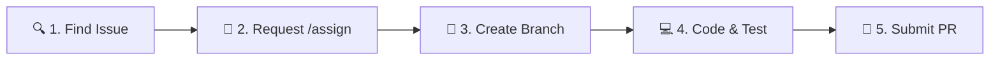

# 🚀 Beginner Tasks - PESIMENS App

Welcome to **PESIMENS**! If you are a first-time contributor or looking for good first issues, this guide will help you get started quickly and make meaningful open-source contributions.

---

## 🧭 How to Get Started (5-Step Contribution Flow)

Follow this standard contributor workflow for a smooth contribution experience:



1. **Find an Issue:** Browse open issues with the [`good first issue`](https://github.com/Darshanpawar7/Pesimens-app/labels/good%20first%20issue) or [`gssoc2026`](https://github.com/Darshanpawar7/Pesimens-app/labels/gssoc2026) label. If you found a new bug or improvement, [open a new issue](https://github.com/Darshanpawar7/Pesimens-app/issues/new) first.
2. **Request Assignment:** Comment on the issue to request assignment (e.g., `"Hi @maintainer, I would like to work on this issue. /assign"`). Wait for the bot/maintainer to assign the issue to you before writing code.
3. **Create a Feature Branch:** Fork the repository, branch from `dev`, and create a descriptive branch:
   ```bash
   git checkout -b fix/landing-page-spacing
   # or
   git checkout -b feat/reusable-spinner-component
   ```
4. **Develop and Test Locally:**
   ```bash
   cd frontend
   npm install
   npm run dev       # Start local dev server at http://localhost:5173
   npm run lint      # Check ESLint rules
   npm run test      # Run Vitest test suite
   ```
5. **Submit a Pull Request (PR):**
   - Keep your PR scoped to a single issue.
   - Reference the issue in your PR body: `Closes #<issue_number>`.
   - Attach **before & after screenshots** or screen recordings for all UI changes.

---

## 📋 Task Categories Matrix

| Category | Difficulty | Estimated Time | Key Skills |
|:---|:---|:---|:---|
| 🎨 **UI & Responsiveness** | Easy / Medium | 30 min – 1.5 hrs | Tailwind CSS, React, Responsive Design |
| ♿ **Accessibility (a11y)** | Easy | 20 – 45 min | Semantic HTML, ARIA, Keyboard Nav |
| ⚡ **Developer Experience (DX)** | Medium | 45 min – 2 hrs | Vitest, TypeScript, ESLint |
| 📝 **Documentation** | Easy | 15 – 30 min | Markdown, Technical Writing |

---

## 🎨 1. UI & Responsiveness Tasks

### Task 1.1: Improve Landing Page Mobile Breakpoints
* **Target File:** `frontend/src/pages/LandingPage.tsx`
* **What to do:** Use unprefixed Tailwind classes for the mobile baseline layout (`320px–480px`), then add `sm:`, `md:`, and `lg:` overrides for larger viewports.
* **Acceptance Criteria:**
  - [ ] No horizontal scrollbars on mobile viewport widths (320px – 480px).
  - [ ] Hero CTA buttons stack vertically on mobile.
  - [ ] Feature cards adjust into a single column on small screens.
  - [ ] PR contains before & after mobile screenshots.

### Task 1.2: Spacing & Typography Consistency
* **Target Files:** `frontend/src/pages/LandingPage.tsx`, `frontend/src/index.css`
* **What to do:** Ensure padding, margins, line heights, and font weights follow the standard Tailwind spacing scale (`p-4`, `py-8`, `gap-6`, etc.).
* **Acceptance Criteria:**
  - [ ] Consistent section padding across landing page sections.
  - [ ] Proper contrast and font size scaling for headers (`h1`, `h2`, `h3`).
  - [ ] No visual regressions on desktop displays.

### Task 1.3: Build Reusable Common UI Components
* **Target Directory:** `frontend/src/components/common/`
* **What to do:** Extract repeated UI widgets into reusable, strongly-typed components (e.g. `EmptyState`, `Spinner`, `Badge`, `ConfirmModal`).
* **Acceptance Criteria:**
  - [ ] Component accepts typed props using TypeScript interfaces.
  - [ ] Supports dark/light mode classes.
  - [ ] Component is integrated into at least one existing page.

---

## ♿ 2. Accessibility (a11y) Tasks

### Task 2.1: Add Missing ARIA Labels & Accessible Names
* **Target Files:** `frontend/src/components/layout/`, `frontend/src/components/common/`
* **What to do:** Add descriptive `aria-label` attributes to icon-only buttons (e.g. close buttons, notification bell, theme toggle, mobile hamburger menu).
* **Acceptance Criteria:**
  - [ ] All icon buttons have an accessible name (`aria-label="..."`).
  - [ ] Screen readers properly announce button purposes.
  - [ ] No accessibility warnings in browser DevTools.

### Task 2.2: Add Meaningful Alt Text on Images & Logos
* **Target Files:** `frontend/src/pages/`, `frontend/src/components/`
* **What to do:** Ensure all `` tags have descriptive `alt` attributes instead of generic or missing text.
* **Acceptance Criteria:**
  - [ ] Logos, user avatars, and illustration images contain descriptive alt text.
  - [ ] Purely decorative images use `alt=""` and `aria-hidden="true"`.

### Task 2.3: Keyboard Navigation & Focus Indicators
* **Target Files:** `frontend/src/components/ui/`, `frontend/src/components/layout/TopNav.tsx`
* **What to do:** Ensure all interactive dropdowns, modals, and navigation links are accessible via keyboard (`Tab`, `Enter`, `Escape`) and have visible focus rings (`focus-visible:ring-2`).
* **Acceptance Criteria:**
  - [ ] All navigation links and buttons are reachable via `Tab` and display a visible focus ring (`focus-visible:ring-2`).
  - [ ] Dropdowns and menus can be opened, navigated, and selected using keyboard keys (`Enter`, `Space`, and arrow keys).
  - [ ] Modals trap focus appropriately and can be dismissed using the `Escape` key.

---

## ⚡ 3. Developer Experience (DX) & Testing Tasks

### Task 3.1: Add Unit Tests for Utility Functions & Components
* **Target Directories:** `frontend/src/__tests__/`, `frontend/src/lib/__tests__/`
* **What to do:** Write Vitest unit tests for helper functions (e.g. date formatters, validation helpers in `frontend/src/lib/validation.ts`).
* **Acceptance Criteria:**
  - [ ] Unit tests written using Vitest and `@testing-library/react`.
  - [ ] All tests pass cleanly when running `npm run test`.
  - [ ] Tests cover both happy paths and edge cases.

### Task 3.2: Enhance ESLint & Type Safety Coverage
* **Target Files:** `frontend/src/`
* **What to do:** Identify and eliminate any implicit `any` types or unused variables across component files.
* **Acceptance Criteria:**
  - [ ] `npm run lint` passes with 0 warnings and 0 errors.
  - [ ] `npm run build` (`tsc && vite build`) compiles without TypeScript errors.

---

## 📝 4. Documentation Tasks

### Task 4.1: Expand Local Setup & Troubleshooting Guide
* **Target Files:** `docs/QUICK_START_GUIDE.md`, `README.md`
* **What to do:** Add troubleshooting tips for common local setup issues (e.g., node version requirements, port conflicts, environment variable setup).
* **Acceptance Criteria:**
  - [ ] Step-by-step instructions are clear for Windows, macOS, and Linux users.
  - [ ] Clear `.env.example` guidance provided.

### Task 4.2: Fix Typos and Improve Documentation Clarity
* **Target Files:** `docs/`, `README.md`, `CONTRIBUTING.md`
* **What to do:** Correct spelling mistakes, clarify ambiguous phrasing, and ensure consistent markdown formatting across all docs.
* **Acceptance Criteria:**
  - [ ] Zero grammatical and spelling errors.
  - [ ] All relative links to files and docs are valid and clickable.

---

## ✅ Pull Request Submission Checklist

Before submitting your PR, double check the following:

- [ ] **Branching:** Created a branch off `dev` with a descriptive name.
- [ ] **Scope:** The PR addresses only the assigned issue.
- [ ] **Local Verification:** Verified `npm run dev`, `npm run lint`, `npm run test`, and `npm run build` pass locally.
- [ ] **Visual Proof:** Attached before/after screenshots or screen recordings for all UI changes.
- [ ] **Issue Linked:** Added `Closes #<issue-id>` in the PR description.
